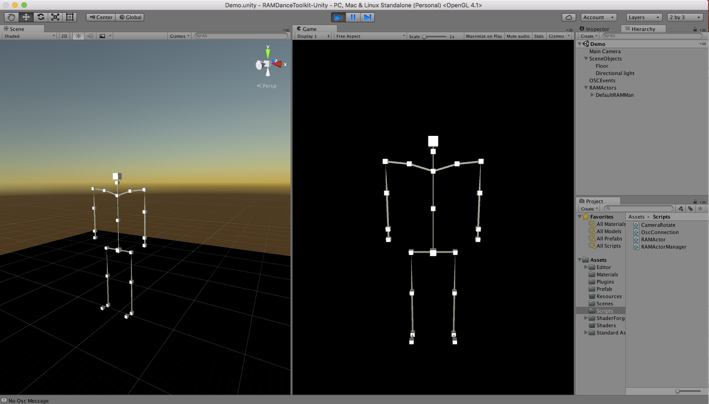

RAMDanceToolkit-Unity
===

**More Documentation to follow.**

This is a starter project that allows users to bring data from the MOTIONER kit into unity.

The current system will recognise when new actors appear and when they leave.

It uses Rug.Osc.

